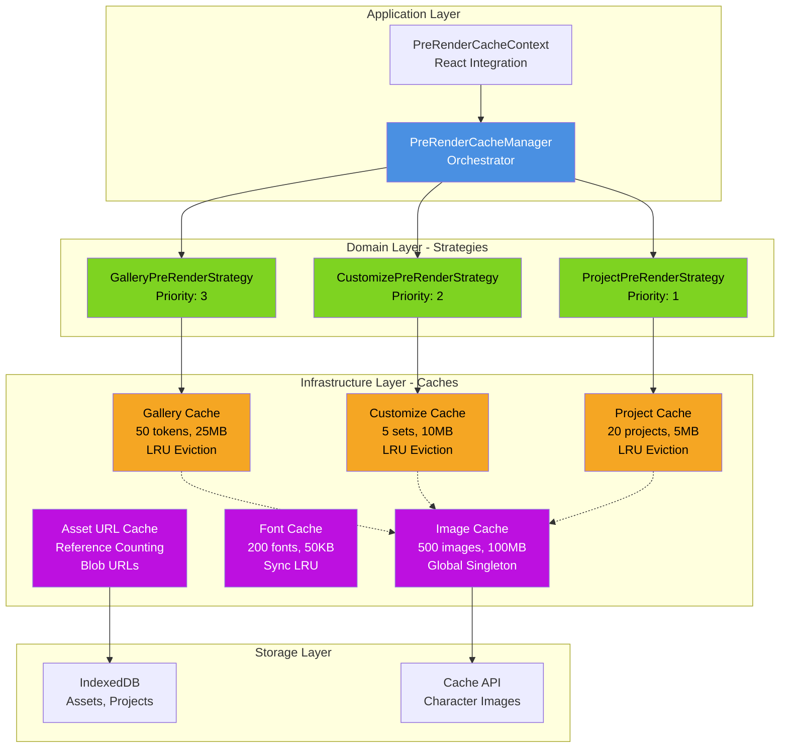
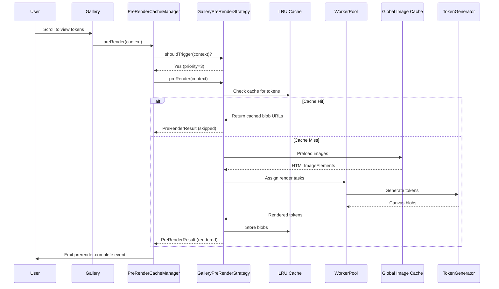
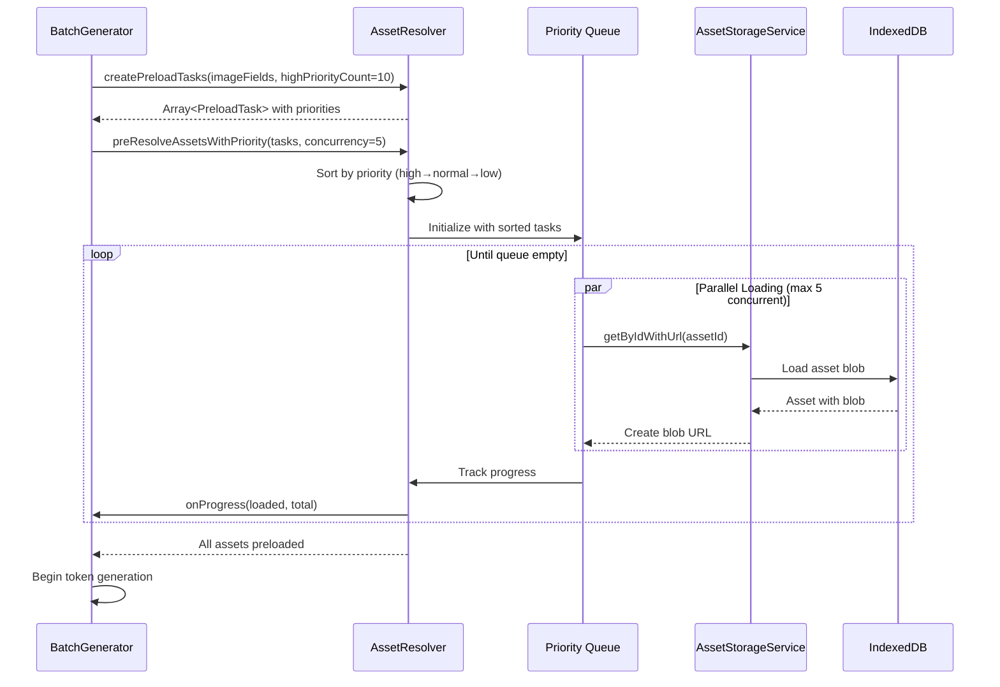

# Cache Architecture - Token Generator

## Overview

The Clocktower Token Generator uses a sophisticated multi-layer cache architecture designed for maximum performance during token generation. The system follows **Hexagonal Architecture** (Ports & Adapters) principles with clear separation between domain logic, infrastructure, and application layers.

---

## Architecture Diagram



---

## Cache Layers

### Layer 1: Pre-Render Cache System

**Purpose:** Pre-render token canvases to data URLs for instant display

**Location:** `src/ts/cache/`

**Components:**
- **PreRenderCacheManager** - Application service that orchestrates all caching
- **Strategies** - Domain services that implement pre-rendering logic
  - `GalleryPreRenderStrategy` - First 20 tokens in gallery view
  - `CustomizePreRenderStrategy` - Current character + variants
  - `ProjectPreRenderStrategy` - Script name token on hover
- **LRU Cache Adapters** - Infrastructure adapters with eviction policies
- **Worker Pool** - Background rendering with Web Workers

**Configuration:**
```typescript
Gallery Cache: 50 tokens, 25MB max, 20% eviction ratio
Customize Cache: 5 character sets, 10MB max, 40% eviction ratio
Project Cache: 20 projects, 5MB max, 30% eviction ratio
```

**Key Features:**
- Request deduplication (prevents duplicate renders)
- Tag-based invalidation (clear by context)
- Event emission (prerender:start, prerender:complete, cache:cleared)
- Worker-based rendering (OffscreenCanvas when supported)
- Priority-based strategy selection

### Layer 2: Global Image Cache

**Purpose:** Cache loaded HTMLImageElement instances for reuse across token generation

**Location:** `src/ts/utils/imageCache.ts`

**Implementation:**
```typescript
class ImageCache {
  private cache: Map<string, CacheEntry>
  maxSizeMB: 100MB
  maxEntries: 500
  evictionPolicy: LRU
}

const globalImageCache = new ImageCache()  // Singleton
```

**Data Flow:**
```
Token Generation Request
  ↓
Check globalImageCache.get(url)
  ↓
Cache Hit? → Return cached HTMLImageElement
  ↓
Cache Miss? → Load image
  ↓
Check if official character → dataSyncService.getCharacterImage()
  ↓
If found → Use cached blob
  ↓
If not → Load from network
  ↓
Store in cache + return
```

**Smart Loading:**
- Official character images: Tries sync storage first (IndexedDB/Cache API)
- External URLs: Loads directly from network (custom images)
- Local files: Uses `loadLocalImage()` helper

**Size Estimation:** `width × height × 4 bytes per pixel`

### Layer 3: Font String Cache

**Purpose:** Cache computed font CSS strings to avoid repeated concatenation

**Location:** `src/ts/cache/instances/fontCache.ts`

**Implementation:**
```typescript
class FontCache {
  private cache: Map<string, string>
  maxEntries: 200
  maxMemory: 50KB
  evictionPolicy: LRU (synchronous)
}

const fontCache = new FontCache()  // Singleton
```

**Use Case:**
```typescript
// Without cache:
const font = `${weight} ${size}px ${family}`  // Computed every render

// With cache:
const font = fontCache.get(key)  // O(1) lookup
```

### Layer 4: Asset URL Cache

**Purpose:** Track blob URLs with reference counting to prevent memory leaks

**Location:** `src/services/upload/AssetStorageService.ts`

**Implementation:**
```typescript
interface UrlCacheEntry {
  url: string              // Main blob URL
  thumbnailUrl: string     // Thumbnail blob URL
  refCount: number         // Reference counter
}

private urlCache: Map<string, UrlCacheEntry>
```

**Lifecycle:**
1. `getAssetUrl(id)` → Create blob URL, set `refCount = 1`, cache
2. Additional calls → Increment `refCount`
3. `releaseUrl(id)` → Decrement `refCount`
4. When `refCount === 0` → `URL.revokeObjectURL()`, remove from cache

**Safety:** Prevents orphaned blob URLs that leak memory

---

## Data Flow

### Token Generation with Caching



### Asset Loading with Priority Queue



---

## Cache Invalidation

### Strategies

**1. Manual Invalidation**
```typescript
// Clear specific cache
preRenderCacheManager.clearCache('gallery')

// Clear all caches
preRenderCacheManager.clearAllCaches()
```

**2. Tag-Based Invalidation**
```typescript
// Store with tags
cache.set(key, value, { tags: ['character:washerwoman', 'project:123'] })

// Invalidate by tag
cache.invalidateByTag('character:washerwoman')
```

**3. TTL-Based Expiration**
```typescript
// Store with TTL
cache.set(key, value, { ttl: 300000 })  // 5 minutes

// Auto-expires on next get()
```

**4. Eviction Events** (New!)
```typescript
// LRU eviction automatically logs:
CacheLogger.logEviction('gallery', key, 'lru', size, lastAccessed, accessCount)

// TTL expiration logs:
CacheLogger.logEviction('gallery', key, 'ttl', size, lastAccessed, accessCount)
```

### Coordination

**Problem:** Multiple independent cache layers can become inconsistent

**Solution (Planned - Phase 2):** Unified `CacheInvalidationService`
```typescript
// Future API:
cacheInvalidationService.invalidateAsset(assetId)
  → Clears asset URL cache
  → Clears image cache
  → Clears pre-render cache entries using that asset

cacheInvalidationService.invalidateCharacter(characterId)
  → Clears all caches referencing that character
```

---

## Performance Characteristics

### Cache Hit Rates (Target)

| Cache | Target Hit Rate | Current Strategy |
|-------|----------------|------------------|
| Pre-Render (Gallery) | >80% | Pre-render first 20 tokens, LRU for rest |
| Pre-Render (Customize) | >90% | Cache all variants for current character |
| Image Cache | >75% | Official images + recently used custom |
| Font Cache | >95% | Small cache, high reuse |
| Asset URL Cache | 100% | Persistent until asset deleted |

### Memory Usage (Typical)

| Cache | Typical Size | Max Size | Eviction Trigger |
|-------|-------------|----------|------------------|
| Pre-Render Caches | 15-30 MB | 40 MB | 80% of max |
| Image Cache | 40-80 MB | 100 MB | LRU when full |
| Font Cache | 5-10 KB | 50 KB | LRU when full |
| Asset URL Cache | Negligible | N/A | Reference counting |
| **Total** | **~70 MB** | **~150 MB** | Per-layer eviction |

### Performance Impact

**Without Caching:**
- Token generation: ~150ms per token
- Batch of 100 tokens: ~15 seconds
- Gallery scroll: Re-render on every frame

**With Caching:**
- First render: ~150ms per token
- Cached render: <5ms (blob URL lookup)
- Batch of 100 tokens: ~15s first time, <1s cached
- Gallery scroll: Instant (pre-rendered)

**Performance Gain:** **~30x faster** for cached tokens

---

## Integration Guide

### React Components

```typescript
import { usePreRenderCache } from '../hooks/usePreRenderCache'

function MyComponent() {
  const cacheManager = usePreRenderCache()

  // Trigger pre-rendering
  const handleScroll = async () => {
    const result = await cacheManager?.preRender({
      type: 'gallery',
      tokens: visibleTokens,
      characters: characters.slice(0, 20)
    })

    console.log(`Rendered: ${result?.rendered}, Skipped: ${result?.skipped}`)
  }

  // Get cache stats
  const stats = cacheManager?.getCacheStats('gallery')
  console.log(`Hit rate: ${(stats?.hitRate * 100).toFixed(1)}%`)
}
```

### Manual Cache Usage

```typescript
import { globalImageCache } from '../ts/utils/imageCache'

// Preload images
await globalImageCache.preloadMany([url1, url2, url3])

// Check if cached
if (globalImageCache.has(url)) {
  const img = await globalImageCache.get(url)
}

// Get stats
const stats = globalImageCache.getStats()
console.log(`${stats.entries} images, ${stats.sizeMB} MB`)
```

### Asset Resolution

```typescript
import {
  isAssetReference,
  resolveAssetUrl,
  preResolveAssetsWithPriority,
  createPreloadTasks
} from '../services/upload/assetResolver'

// Check if URL is asset reference
if (isAssetReference('asset:abc-123')) {
  // Resolve to blob URL
  const blobUrl = await resolveAssetUrl('asset:abc-123')
}

// Priority-based batch preloading
const imageFields = characters.map(c => c.image)
const tasks = createPreloadTasks(imageFields, 10)  // First 10 = high priority

await preResolveAssetsWithPriority(tasks, {
  concurrency: 5,
  onProgress: (loaded, total) => {
    console.log(`${loaded}/${total} assets loaded`)
  }
})
```

---

## Debugging & Monitoring

### Enable Debug Logging

```typescript
import { CacheLogger, CacheLogLevel } from '../ts/cache/index'

// Set log level (persists to localStorage)
CacheLogger.setLevel(CacheLogLevel.DEBUG)

// Or via DevTools console:
__CacheLogger__.setLevel(4)  // DEBUG level
```

### View Cache Stats

```javascript
// In browser console:
const manager = window.__PreRenderCacheManager__  // If exposed
const stats = manager.getAllCacheStats()

console.table({
  gallery: stats.gallery,
  customize: stats.customize,
  project: stats.project
})
```

### Export Metrics

```typescript
// Export performance metrics as JSON
const metrics = CacheLogger.exportMetrics()
console.log(metrics)

// Download for analysis
const blob = new Blob([metrics], { type: 'application/json' })
const url = URL.createObjectURL(blob)
// ... trigger download
```

### Monitor Evictions

```typescript
// Evictions are automatically logged at DEBUG level:
// [Cache:DEBUG] Cache eviction: gallery
//   {
//     key: "token_washerwoman",
//     reason: "lru",
//     size: "0.48 MB",
//     age: "120s ago",
//     accessCount: 5
//   }
```

---

## Best Practices

### DO ✅

1. **Use pre-rendering for repeated renders**
   - Gallery views, project hover previews

2. **Preload assets before batch operations**
   - Use `preResolveAssetsWithPriority()` for optimal performance

3. **Monitor cache hit rates**
   - Target >80% hit rate for pre-render caches

4. **Clear caches when data changes**
   - Delete asset → invalidate all caches using it

5. **Use appropriate cache for use case**
   - Pre-render: For display (data URLs)
   - Image cache: For generation (HTMLImageElements)
   - Asset URL cache: For references (blob URLs)

### DON'T ❌

1. **Don't manually create blob URLs for assets**
   - Use `AssetStorageService.getAssetUrl()` with reference counting

2. **Don't cache large objects without size limits**
   - Always implement eviction policies

3. **Don't ignore cache statistics**
   - Low hit rates indicate cache misses → adjust strategy

4. **Don't forget to release asset URLs**
   - Call `releaseUrl()` when done to prevent leaks

5. **Don't bypass the cache for repeated operations**
   - If generating same token 10x, cache it after first generation

---

## Future Enhancements (Phases 2-4)

### Phase 2: Architecture Improvements
- **Unified Cache Invalidation Coordinator** - Cross-layer invalidation
- **Cache Layer Facade** - Simplified API (`CacheManager`)
- **Cache Warming Policies** - Proactive preloading on app start
- **WeakRef-Based Asset Tracking** - Automatic URL cleanup

### Phase 3: Storage & UX
- **Query Optimization** - Compound indexes for faster asset lookups
- **Asset Deduplication** - SHA-256 hashing to detect duplicates
- **Usage Tracking** - Track when/how often assets are used
- **Progressive Loading** - Virtual scrolling for 500+ asset libraries

### Phase 4: Observability
- **Cache Inspector DevTools** - Visual debugging panel
- **Performance Profiler** - Hit rate analysis + recommendations
- **Type-Safe References** - Branded types for asset references
- **Comprehensive Test Utilities** - Mock factories for testing

---

## References

- **Hexagonal Architecture:** Ports & Adapters pattern for clean separation
- **LRU Eviction:** Least Recently Used algorithm for optimal cache utilization
- **Web Workers:** Background processing for non-blocking rendering
- **OffscreenCanvas:** Hardware-accelerated canvas in workers
- **IndexedDB:** Persistent storage for assets and projects
- **Cache API:** Service worker cache for character images

---

**Last Updated:** 2025-12-10
**Version:** 1.0
**Maintainer:** Asset Manager & Cache System Team
