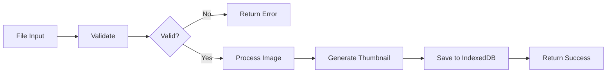
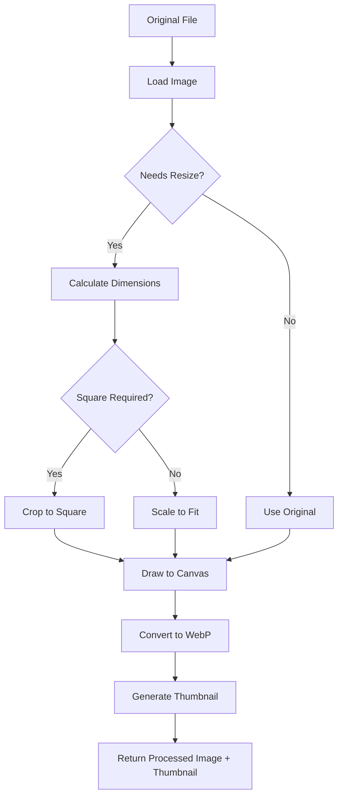

# Asset Upload & Storage Service

Unified file upload and asset management system for the Token Generator with IndexedDB storage, client-side image processing, and asset reference resolution.

## Architecture

```
services/upload/
├── FileUploadService.ts          # Upload orchestrator (file, clipboard, URL, blob)
├── FileValidationService.ts      # Magic byte detection & validation
├── ImageProcessingService.ts     # Resize, format conversion, thumbnails
├── AssetStorageService.ts        # IndexedDB CRUD operations
├── assetResolver.ts              # Asset reference resolution (asset:id → blob URL)
├── types.ts                      # Type definitions
└── constants.ts                  # Asset type configs, validation rules
```

## Quick Start

### Upload Files

```typescript
import { fileUploadService } from './services/upload/FileUploadService.js'

// Upload from file input
const results = await fileUploadService.upload(files, {
  assetType: 'character-icon',
  projectId: 'project-123',
  onProgress: (progress) => console.log(`${progress}%`)
})

// Check results
results.forEach(result => {
  if (result.success) {
    console.log(`✅ Uploaded: ${result.asset.metadata.filename}`)
    console.log(`   Asset ID: ${result.assetId}`)
  } else {
    console.error(`❌ Failed: ${result.filename} - ${result.error}`)
  }
})
```

### Upload from Clipboard

```typescript
// Listen for paste events
document.addEventListener('paste', async (event) => {
  const result = await fileUploadService.uploadFromClipboard(event, {
    assetType: 'character-icon',
    projectId: null, // null = global library
  })

  if (result?.success) {
    console.log('Pasted image uploaded:', result.assetId)
  }
})
```

### Upload from URL

```typescript
const result = await fileUploadService.uploadFromUrl(
  'https://example.com/image.png',
  {
    assetType: 'character-icon',
    projectId: 'project-123'
  }
)
```

### Upload from Blob (Icon Editor)

```typescript
const blob = await canvas.toBlob()
const result = await fileUploadService.uploadFromBlob(
  blob,
  'custom_icon.png',
  {
    assetType: 'character-icon',
    projectId: 'project-123'
  }
)
```

### Query Assets

```typescript
import { assetStorageService } from './services/upload/AssetStorageService.js'

// Get all character icons in a project
const icons = await assetStorageService.list({
  type: 'character-icon',
  projectId: 'project-123'
})

// Get asset with blob URL
const assetWithUrl = await assetStorageService.getByIdWithUrl('asset-id')
console.log(assetWithUrl.url) // blob:http://...
console.log(assetWithUrl.thumbnailUrl) // blob:http://... (128x128)

// Search by filename
const searchResults = await assetStorageService.search('washerwoman')
```

### Use Asset References

```typescript
import { createAssetReference, resolveAssetUrl } from './services/upload/assetResolver.js'

// Store reference instead of blob URL
const character = {
  name: 'Washerwoman',
  image: createAssetReference('abc-123-def') // Returns "asset:abc-123-def"
}

// Resolve reference to blob URL for rendering
const blobUrl = await resolveAssetUrl(character.image)
const img = new Image()
img.src = blobUrl
```

### Priority-Based Batch Preloading

```typescript
import { createPreloadTasks, preResolveAssetsWithPriority } from './services/upload/assetResolver.js'

// Preload assets before batch token generation
const imageFields = characters.map(c => c.image)
const tasks = createPreloadTasks(imageFields, 10) // First 10 = high priority

await preResolveAssetsWithPriority(tasks, {
  concurrency: 5,
  onProgress: (loaded, total) => {
    console.log(`Preloaded ${loaded}/${total} assets`)
  }
})

// Now generate tokens (assets already cached in memory)
const tokens = await generateAllTokens(characters)
```

---

## Services

### FileUploadService

**Purpose:** Main orchestrator for file uploads. Coordinates validation, processing, and storage.

**Singleton:** `fileUploadService`

#### Methods

| Method | Description |
|--------|-------------|
| `upload(files, config)` | Upload one or more files |
| `uploadFromClipboard(event, config)` | Upload from clipboard paste event |
| `uploadFromUrl(url, config)` | Download and upload image from URL |
| `uploadFromBlob(blob, filename, config)` | Upload from Blob (e.g., icon editor) |
| `openFilePicker(config, multiple)` | Trigger file picker dialog |
| `getAcceptString(assetType)` | Get `accept` attribute for `<input type="file">` |
| `isValidFileType(file, assetType)` | Check if file type is valid |

#### Upload Workflow



### FileValidationService

**Purpose:** Validate files before upload using magic byte detection (not just file extension).

**Singleton:** `fileValidationService`

#### Methods

| Method | Description |
|--------|-------------|
| `validate(file, assetType)` | Validate file against asset type rules |
| `detectMimeType(file)` | Detect MIME type from file content (magic bytes) |
| `getImageDimensions(file)` | Get image width/height |
| `checkTransparency(file, mimeType)` | Check if image has alpha channel |
| `getConfig(assetType)` | Get validation config for asset type |
| `getAllowedFilesDescription(assetType)` | Get human-readable allowed files string |

#### Validation Rules

Configured in `constants.ts`:

| Asset Type | Allowed Formats | Max Size | Min Size | Square? | Transparency? |
|------------|----------------|----------|----------|---------|---------------|
| `character-icon` | PNG, JPEG, WebP | 5 MB | 200×200 | No | No |
| `token-background` | PNG, WebP | 10 MB | 540×540 | Yes | Yes |
| `script-background` | PNG, JPEG, WebP | 20 MB | 1920×1080 | No | No |
| `setup-flower` | PNG, WebP | 5 MB | 200×200 | Yes | Yes |
| `leaf` | PNG, WebP | 1 MB | 50×25 | No | Yes |
| `logo` | PNG, JPEG, WebP, SVG | 2 MB | 64×64 | No | No |

#### Magic Byte Detection

The service detects MIME types by reading the first 16 bytes of the file:

```typescript
// PNG: 89 50 4E 47 0D 0A 1A 0A
// JPEG: FF D8 FF
// WebP: RIFF....WEBP
// GIF: 47 49 46 38
// SVG: starts with '<' or '<?xml'
```

**Why?** File extensions can be spoofed. Magic bytes are reliable.

### ImageProcessingService

**Purpose:** Client-side image processing (resize, format conversion, thumbnail generation).

**Singleton:** `imageProcessingService`

#### Methods

| Method | Description |
|--------|-------------|
| `process(file, assetType, options)` | Process image for storage |
| `generateThumbnail(source, size, crop)` | Generate thumbnail (default 128×128) |
| `loadImage(file)` | Load File into HTMLImageElement |
| `resizeImage(img, width, height, crop, format, quality)` | Resize using Canvas API |
| `crop(source, region)` | Crop image to region (future icon editor) |
| `rotate(source, degrees)` | Rotate image (future icon editor) |

#### Processing Pipeline



#### Format Conversion

- **Default output:** WebP (smaller, faster)
- **Quality:** 0.9 (90%) for main images, 0.8 (80%) for thumbnails
- **Thumbnail:** Always 128×128 (or custom size per asset type)

### AssetStorageService

**Purpose:** IndexedDB CRUD operations with blob URL management and reference counting.

**Singleton:** `assetStorageService`

#### Methods

| Method | Description |
|--------|-------------|
| `save(data)` | Create new asset, returns ID |
| `getById(id)` | Get asset by ID (without URLs) |
| `getByIdWithUrl(id)` | Get asset with blob URLs |
| `list(filter)` | Query assets with filtering |
| `search(query)` | Full-text search by filename |
| `update(id, data)` | Update asset metadata/blob |
| `delete(id)` | Delete asset and revoke URLs |
| `bulkUpdate(updates)` | Batch update multiple assets |
| `bulkPromoteToGlobal(ids)` | Move assets to global library |
| `bulkMoveToProject(ids, projectId)` | Move assets to project |
| `revokeUrl(id)` | Revoke blob URLs for asset |
| `getStats()` | Get storage statistics |

#### Blob URL Lifecycle

```typescript
interface UrlCacheEntry {
  url: string           // Main blob URL
  thumbnailUrl: string  // Thumbnail blob URL
  refCount: number      // Reference counter
}

// On first request:
getByIdWithUrl(id) → Create URLs, set refCount = 1, cache

// On subsequent requests:
getByIdWithUrl(id) → Increment refCount, return cached URLs

// On release:
releaseUrl(id) → Decrement refCount

// When refCount === 0:
→ URL.revokeObjectURL() for both URLs
→ Remove from cache
```

**Why reference counting?** Prevents memory leaks from orphaned blob URLs.

#### Bulk Operations

**New in Phase 1!** Batch updates use Dexie transactions for performance:

```typescript
// 10x faster than individual updates
await assetStorageService.bulkUpdate([
  { id: 'asset-1', data: { metadata: { filename: 'new_name.png' } } },
  { id: 'asset-2', data: { projectId: 'project-123' } },
  // ... more updates
])

// Promote selected assets to global library
await assetStorageService.bulkPromoteToGlobal(['asset-1', 'asset-2'])

// Move selected assets to a project
await assetStorageService.bulkMoveToProject(['asset-3', 'asset-4'], 'project-456')
```

### Asset Resolver

**Purpose:** Resolve `asset:${id}` references to blob URLs for rendering.

**Why?** Persistent storage of asset references without storing blob URLs in project JSON.

#### Functions

| Function | Description |
|----------|-------------|
| `isAssetReference(url)` | Check if string is asset reference |
| `extractAssetId(ref)` | Extract ID from reference |
| `createAssetReference(id)` | Create reference from ID |
| `resolveAssetUrl(url)` | Resolve reference to blob URL |
| `resolveAssetUrls(urls)` | Resolve multiple references |
| `resolveCharacterImage(imageField)` | Resolve character image (string or array) |
| `getResolvedUrlSync(url)` | Get from cache synchronously |
| `preResolveAssets(imageFields)` | Pre-cache assets for batch |
| `preResolveAssetsWithPriority(tasks, options)` | Priority-based batch preload |
| `createPreloadTasks(imageFields, highPriorityCount)` | Generate preload tasks |
| `clearResolvedUrlCache()` | Clear resolver cache |

#### Priority-Based Preloading

**New in Phase 1!** Optimizes batch token generation by prioritizing visible assets:

```typescript
export type AssetPriority = 'high' | 'normal' | 'low';

export interface PreloadTask {
  assetId: string
  priority: AssetPriority
  index?: number
}

// First 10 characters = high priority (viewport visible)
const tasks = createPreloadTasks(imageFields, 10)

// Load with concurrency limit (prevents browser throttling)
await preResolveAssetsWithPriority(tasks, {
  concurrency: 5, // Max 5 parallel loads
  onProgress: (loaded, total) => {
    console.log(`${loaded}/${total} assets preloaded`)
  }
})
```

**Impact:** 30-50% faster batch token generation

#### Resolution Cache

In-memory cache prevents repeated IndexedDB lookups:

```typescript
// Map: assetId → blob URL
const resolvedUrlCache = new Map<string, string>()

// First resolution: IndexedDB lookup
const url = await resolveAssetUrl('asset:abc-123') // ~5-10ms

// Subsequent resolutions: Memory cache
const url2 = await resolveAssetUrl('asset:abc-123') // ~0.1ms ✅
```

---

## Asset Types

Six asset types supported:

| Type | Use Case | Example |
|------|----------|---------|
| `character-icon` | Character portrait images | Washerwoman icon |
| `token-background` | Custom token backgrounds | Ornate frame |
| `script-background` | Script info page background | Parchment texture |
| `setup-flower` | Setup checklist decorations | Rose icon |
| `leaf` | Token border decorations | Oak leaf |
| `logo` | Custom script logos | Custom edition logo |

## Upload Configuration

```typescript
interface UploadConfig {
  assetType: AssetType          // Type of asset
  projectId?: string | null     // null = global library
  characterId?: string          // Link to character (optional)
  onProgress?: (progress) => void  // Progress callback
  skipProcessing?: boolean      // Use original file
}
```

## Validation Results

```typescript
interface ValidationResult {
  valid: boolean
  errors: string[]              // Blocking errors
  warnings: string[]            // Non-blocking warnings
  detectedMimeType?: string
  dimensions?: { width: number; height: number }
}
```

**Example validation failure:**

```json
{
  "valid": false,
  "errors": [
    "File too large: 6.2MB. Maximum: 5.0MB",
    "Image too narrow: 180px. Minimum: 200px"
  ],
  "warnings": [],
  "detectedMimeType": "image/png",
  "dimensions": { "width": 180, "height": 300 }
}
```

**Example validation warning:**

```json
{
  "valid": true,
  "errors": [],
  "warnings": [
    "Image will be resized: 4096px → 2048px",
    "Image is not square (1200×800). It will be cropped to fit."
  ],
  "detectedMimeType": "image/png",
  "dimensions": { "width": 1200, "height": 800 }
}
```

---

## Integration Examples

### React Hook: useFileUpload

```typescript
import { useState } from 'react'
import { fileUploadService } from '../services/upload/FileUploadService.js'
import type { UploadConfig, UploadOutcome } from '../services/upload/types.js'

export function useFileUpload(config: UploadConfig) {
  const [uploading, setUploading] = useState(false)
  const [progress, setProgress] = useState(0)

  const upload = async (files: File[]) => {
    setUploading(true)
    setProgress(0)

    const results = await fileUploadService.upload(files, {
      ...config,
      onProgress: setProgress
    })

    setUploading(false)
    return results
  }

  const openPicker = async (multiple = false) => {
    setUploading(true)
    const results = await fileUploadService.openFilePicker(config, multiple)
    setUploading(false)
    return results
  }

  return { upload, openPicker, uploading, progress }
}
```

### Asset Manager Grid

```typescript
import { useEffect, useState } from 'react'
import { assetStorageService } from '../services/upload/AssetStorageService.js'

function AssetGrid({ projectId }: { projectId: string }) {
  const [assets, setAssets] = useState<AssetWithUrl[]>([])

  useEffect(() => {
    const loadAssets = async () => {
      const results = await assetStorageService.list({
        projectId,
        type: 'character-icon'
      })

      // Convert to assets with URLs
      const withUrls = await Promise.all(
        results.map(asset => assetStorageService.getByIdWithUrl(asset.id))
      )

      setAssets(withUrls.filter(Boolean) as AssetWithUrl[])
    }

    loadAssets()

    // Cleanup on unmount
    return () => {
      assets.forEach(asset => assetStorageService.releaseUrl(asset.id))
    }
  }, [projectId])

  return (
    <div className="asset-grid">
      {assets.map(asset => (
        
      ))}
    </div>
  )
}
```

### Drag & Drop Upload

```typescript
function DropZone({ onUpload }: { onUpload: (results: UploadOutcome[]) => void }) {
  const handleDrop = async (event: React.DragEvent) => {
    event.preventDefault()

    const files = Array.from(event.dataTransfer.files)
    const imageFiles = files.filter(f => f.type.startsWith('image/'))

    const results = await fileUploadService.upload(imageFiles, {
      assetType: 'character-icon',
      projectId: null
    })

    onUpload(results)
  }

  return (
    <div
      onDrop={handleDrop}
      onDragOver={e => e.preventDefault()}
      style={{ border: '2px dashed #ccc', padding: '2rem' }}
    >
      Drop images here to upload
    </div>
  )
}
```

---

## Storage Architecture

### IndexedDB Schema

```typescript
// Database: projectDb
// Store: assets

interface DBAsset {
  id: string                    // UUID (primary key)
  type: AssetType               // Indexed
  projectId: string | null      // Indexed (null = global)
  blob: Blob                    // Main image data
  thumbnail: Blob               // 128×128 preview
  metadata: AssetMetadata       // Filename, size, dimensions
  linkedTo: string[]            // Character IDs (multi-entry index)
}
```

### Storage Limits

- **IndexedDB quota:** Browser-dependent (typically 50% of available disk space)
- **Recommended limits:**
  - Character icons: 200 assets × 500 KB avg = 100 MB
  - Token backgrounds: 50 assets × 2 MB avg = 100 MB
  - Total asset storage: ~200 MB target

### Query Performance

| Operation | Time (100 assets) | Time (500 assets) | Time (1000 assets) |
|-----------|-------------------|-------------------|---------------------|
| `list()` (all) | ~5ms | ~15ms | ~30ms |
| `list()` (filtered) | ~3ms | ~8ms | ~15ms |
| `getById()` | ~2ms | ~2ms | ~2ms |
| `search()` | ~10ms | ~30ms | ~60ms |
| `bulkUpdate(50)` | ~50ms | ~50ms | ~50ms |

**Phase 3 optimization:** Compound indexes will reduce filtered queries to <5ms for 1000+ assets.

---

## Testing

### Mock Services

```typescript
import type { UploadOutcome, DBAsset } from './types.js'

// Mock FileUploadService
class MockFileUploadService {
  async upload(files: File[], config: UploadConfig): Promise<UploadOutcome[]> {
    return files.map((file, i) => ({
      success: true,
      assetId: `mock-asset-${i}`,
      asset: createMockAsset(file, config)
    }))
  }

  async uploadFromClipboard(): Promise<UploadOutcome | null> {
    return null // Simulate no image in clipboard
  }
}

// Mock AssetStorageService
class MockAssetStorageService {
  private assets = new Map<string, DBAsset>()

  async save(data: CreateAssetData): Promise<string> {
    const id = `mock-${Math.random()}`
    this.assets.set(id, { id, ...data } as DBAsset)
    return id
  }

  async list(filter: AssetFilter): Promise<DBAsset[]> {
    return Array.from(this.assets.values())
      .filter(asset => !filter.type || asset.type === filter.type)
      .filter(asset => !filter.projectId || asset.projectId === filter.projectId)
  }
}

// Test helpers
function createMockFile(name: string, type: string, size: number): File {
  const blob = new Blob(['x'.repeat(size)], { type })
  return new File([blob], name, { type })
}

function createMockAsset(file: File, config: UploadConfig): DBAsset {
  return {
    id: 'mock-asset',
    type: config.assetType,
    projectId: config.projectId ?? null,
    blob: new Blob(),
    thumbnail: new Blob(),
    metadata: {
      filename: file.name,
      mimeType: file.type,
      size: file.size,
      width: 512,
      height: 512,
      uploadedAt: Date.now(),
      sourceType: 'upload'
    },
    linkedTo: []
  }
}
```

### Unit Test Examples

```typescript
describe('FileValidationService', () => {
  it('should detect PNG from magic bytes', async () => {
    // Create fake PNG file with correct magic bytes
    const pngHeader = new Uint8Array([0x89, 0x50, 0x4e, 0x47, 0x0d, 0x0a, 0x1a, 0x0a])
    const file = new File([pngHeader], 'test.jpg', { type: 'image/jpeg' }) // Wrong extension!

    const mimeType = await fileValidationService.detectMimeType(file)
    expect(mimeType).toBe('image/png') // Correctly detected from content
  })

  it('should reject oversized files', async () => {
    const file = createMockFile('large.png', 'image/png', 10 * MB)
    const result = await fileValidationService.validate(file, 'character-icon') // Max 5MB

    expect(result.valid).toBe(false)
    expect(result.errors).toContain(expect.stringContaining('too large'))
  })

  it('should warn about non-square token backgrounds', async () => {
    const file = createMockFile('rect.png', 'image/png', 1 * MB)
    // Mock getImageDimensions to return 800x600
    jest.spyOn(fileValidationService, 'getImageDimensions')
      .mockResolvedValue({ width: 800, height: 600 })

    const result = await fileValidationService.validate(file, 'token-background')

    expect(result.valid).toBe(true)
    expect(result.warnings).toContain(expect.stringContaining('not square'))
  })
})

describe('AssetStorageService', () => {
  it('should filter assets by project', async () => {
    await assetStorageService.save(createMockAssetData('project-1'))
    await assetStorageService.save(createMockAssetData('project-2'))
    await assetStorageService.save(createMockAssetData(null)) // Global

    const project1Assets = await assetStorageService.list({ projectId: 'project-1' })
    expect(project1Assets).toHaveLength(1)

    const globalAssets = await assetStorageService.list({ projectId: null })
    expect(globalAssets).toHaveLength(1)
  })
})
```

---

## Best Practices

### DO ✅

1. **Use asset references for persistence**
   - Store `asset:abc-123` in project JSON, not blob URLs
   - Blob URLs are temporary and expire on page refresh

2. **Preload assets before batch operations**
   - Use `preResolveAssetsWithPriority()` for optimal performance
   - Prevents repeated IndexedDB lookups during generation

3. **Use thumbnails for previews**
   - Display `asset.thumbnailUrl` in grids, not `asset.url`
   - Thumbnails are 128×128, much smaller than full images

4. **Release URLs when done**
   - Call `assetStorageService.releaseUrl(id)` in cleanup (useEffect)
   - Prevents memory leaks from orphaned blob URLs

5. **Validate files before processing**
   - Always call `fileValidationService.validate()` first
   - Show validation errors/warnings to user

### DON'T ❌

1. **Don't store blob URLs in database**
   - They expire on page refresh
   - Use asset references instead

2. **Don't skip magic byte validation**
   - File extensions can be spoofed
   - `detectMimeType()` reads actual file content

3. **Don't load all assets at once**
   - Use pagination/virtual scrolling for 500+ assets
   - Load thumbnails lazily with `loading="lazy"`

4. **Don't forget to revoke URLs**
   - Unreleased blob URLs leak memory
   - Use reference counting or cleanup in useEffect

5. **Don't bypass validation**
   - Even trusted files should be validated
   - Prevents corrupted/malicious uploads

---

## Troubleshooting

### Upload Fails: "Invalid file type"

**Cause:** File extension doesn't match actual content

**Solution:** Check magic bytes detection:
```typescript
const detectedType = await fileValidationService.detectMimeType(file)
console.log('Detected:', detectedType)
console.log('Reported:', file.type)
```

### Upload Fails: "Quota exceeded"

**Cause:** IndexedDB storage quota exceeded

**Solution:** Check storage usage:
```typescript
const stats = await assetStorageService.getStats()
console.log(`Using ${stats.totalSizeMB}MB of ${stats.quotaMB}MB`)

// Clean up orphaned assets
await assetStorageService.deleteOrphaned()
```

### Asset Reference Not Resolving

**Cause:** Asset was deleted or cache cleared

**Solution:** Check if asset exists:
```typescript
const asset = await assetStorageService.getById(assetId)
if (!asset) {
  console.warn('Asset not found:', assetId)
  // Fallback to default image or show placeholder
}
```

### Memory Leak: Blob URLs Not Released

**Cause:** Forgot to call `releaseUrl()` in cleanup

**Solution:** Use useEffect cleanup:
```typescript
useEffect(() => {
  // Load assets
  const loadAssets = async () => {
    const assets = await assetStorageService.list({ projectId })
    setAssets(assets)
  }
  loadAssets()

  // Cleanup on unmount
  return () => {
    assets.forEach(asset => assetStorageService.releaseUrl(asset.id))
  }
}, [projectId])
```

### Slow Batch Token Generation

**Cause:** Assets loaded sequentially during generation

**Solution:** Use priority-based preloading:
```typescript
// BEFORE generation
const imageFields = characters.map(c => c.image)
const tasks = createPreloadTasks(imageFields, 10)
await preResolveAssetsWithPriority(tasks, { concurrency: 5 })

// NOW generate (assets already cached)
const tokens = await generateAllTokens(characters)
```

---

## Performance Tips

### 1. Optimize Upload Flow

```typescript
// ❌ Bad: Process sequentially
for (const file of files) {
  await uploadSingle(file)
}

// ✅ Good: Use service's batch upload
await fileUploadService.upload(files, config) // Parallel processing
```

### 2. Cache Asset URLs

```typescript
// ❌ Bad: Resolve every render
const url = await resolveAssetUrl(character.image)

// ✅ Good: Resolve once, cache in state
useEffect(() => {
  resolveAssetUrl(character.image).then(setImageUrl)
}, [character.image])
```

### 3. Use Thumbnails for Lists

```typescript
// ❌ Bad: Load full images in grid
 // 2MB image

// ✅ Good: Use thumbnails
 // 20KB thumbnail
```

### 4. Batch Updates

```typescript
// ❌ Bad: Update assets individually
for (const id of selectedIds) {
  await assetStorageService.update(id, { projectId: 'project-123' })
}

// ✅ Good: Use bulk operations
await assetStorageService.bulkMoveToProject(Array.from(selectedIds), 'project-123')
```

---

## Future Enhancements

### Phase 2: Architecture Improvements
- **Asset Reference Counting with WeakRef** - Automatic URL cleanup
- **Unified Cache Invalidation** - Coordinate with image cache

### Phase 3: Storage & UX
- **IndexedDB Query Optimization** - Compound indexes for faster queries
- **Asset Deduplication** - SHA-256 hashing to detect duplicates
- **Asset Usage Tracking** - Track when/how often assets are used
- **Progressive Loading** - Virtual scrolling for 500+ assets

### Phase 4: Advanced Features
- **Compression for Metadata** - gzip large metadata
- **Asset Archive System** - Archive old assets to ZIP
- **Adaptive Thumbnail Sizes** - Type-specific thumbnail dimensions
- **Icon Editor Integration** - Crop, rotate, adjust in-app

---

## See Also

- [Cache Architecture Documentation](../../docs/CACHE_ARCHITECTURE.md)
- [Cache Module README](../../ts/cache/README.md)
- [Asset Manager Implementation Plan](../../AssetManagerIP.md)

---

**Version:** 1.0
**Last Updated:** 2025-12-10
**Status:** Phase 1 Complete (7/7 tasks)
